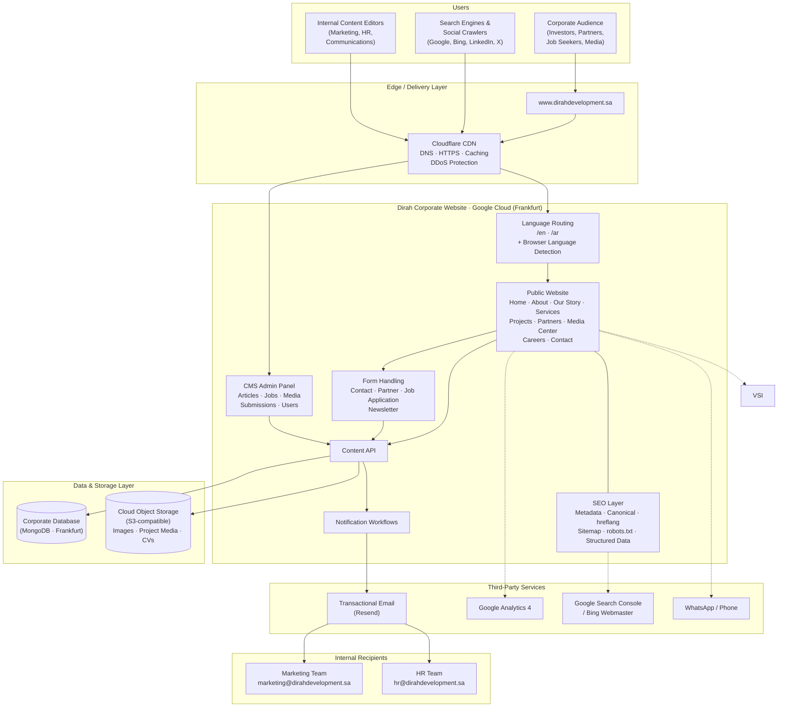
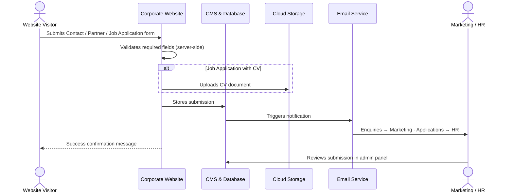
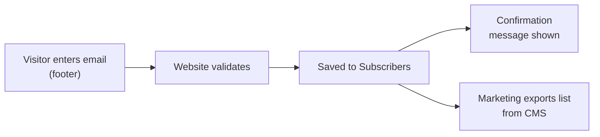
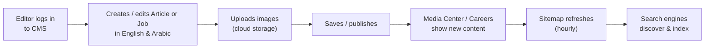
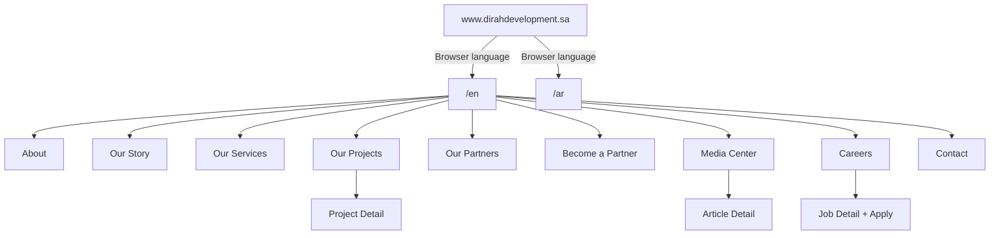
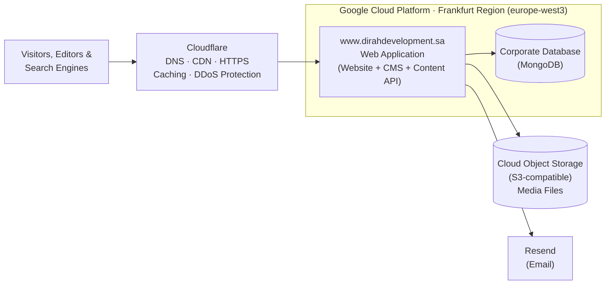
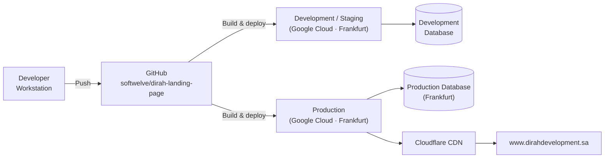

# Dirah Corporate Website: Architecture Document

**Platform:** Dirah Corporate Website
**Production Domain:** `www.dirahdevelopment.sa`
**Version:** 1.0

---

## 1. Purpose

This document describes the high-level architecture of the **Dirah Corporate Website**. It covers what the platform does, its main building blocks, how content and data move through the system, the third-party services involved, security, and SEO.

It is written for stakeholders, project managers, marketing/SEO teams, and technical leads who need to understand the system without reading the code.

| Item | Details |
|---|---|
| **Owner** | Dirah Development Company |
| **Audience** | Investors, business partners, job seekers, media, the general public |
| **Content owners** | Corporate Communications, Marketing, HR |
| **Languages** | English and Arabic (right-to-left) |

---

## 2. Platform Overview

The Dirah Corporate Website is the official online presence of **Dirah Development Company**. It presents the company, its vision, leadership, services, and real estate/destination projects in the heart of Riyadh. It also takes business, partnership, and talent enquiries.

### 2.1 Key Capabilities

- **Company profile:** About, Our Story, Mission and Vision, Values, Objectives, Board of Directors, Executive Team
- **Our Services:** the company's asset development and management services
- **Our Projects:** project portfolio, with a detail page for each project
- **Our Partners:** partner showcase, plus a "Become a Partner" application form
- **Media Center:** news articles, latest news carousel, article detail pages with related news
- **Careers:** job listings, job detail pages, online job applications with CV upload
- **Contact:** contact form with enquiry types and country code selection
- **Newsletter:** email subscription
- **Bilingual experience:** full English/Arabic with a language switcher and right-to-left layout for Arabic
- **Quick contact:** floating WhatsApp and Call buttons
- **CMS admin panel:** where internal teams manage content and review submissions

---

## 3. High-Level Architecture Diagram

**Legend:** Solid arrows are core request and data flows. Dotted arrows are browser-side or reporting integrations.

---

## 4. Architectural Layers

The Corporate Website is a **single, self-contained web application**. One deployment serves the public website, the content API, and the CMS admin panel, backed by its own database.

| Layer | Responsibility |
|---|---|
| **Delivery (Edge)** | Cloudflare CDN: DNS, HTTPS, caching, and DDoS protection. The application adds security headers to every response |
| **Language Routing** | Every URL carries a language prefix (`/en/...` or `/ar/...`). First-time visitors to the bare domain go to Arabic if their browser prefers Arabic, otherwise English. |
| **Presentation** | Responsive, bilingual pages with RTL support and custom Arabic and English brand fonts |
| **SEO Layer** | Page titles, descriptions, social previews, canonical URLs, language alternates, sitemap, robots rules, structured data |
| **Form Handling** | Validates submissions on the server and saves them securely |
| **Content Management (CMS)** | Web-based admin panel for staff to create and edit content without developers |
| **Content API** | Internal service the website and CMS use to read and write content |
| **Notification Workflows** | Automatic emails to internal teams when submissions arrive |
| **Data** | Dedicated MongoDB database for content and submissions, in the Google Cloud Frankfurt region |
| **File Storage** | S3-compatible cloud storage for images, project galleries, and uploaded CVs |
| **Integrations** | Email, analytics, performance monitoring |

### 4.1 Technology Summary (Non-Technical View)

| Concern | Choice | Why it matters |
|---|---|---|
| Web framework | Next.js (React), a modern server-rendering framework | Fast pages that search engines can read |
| CMS | Payload CMS, built into the same application | One system to host, and editors get a user-friendly admin panel |
| Database | MongoDB (Frankfurt region) | Flexible storage for multilingual content, close to the application |
| Media storage | S3-compatible object storage | Scalable, durable file hosting, separate from the application |
| Email | Resend (sender: `website@dirahdevelopment.sa`) | Reliable delivery of internal notifications |
| Rich text | Built-in visual editor | Editors format articles without HTML |
| CMS languages | English and Arabic admin interface | Arabic-speaking staff can use the admin panel |
| CDN | Cloudflare | Fast delivery from edge locations near visitors, HTTPS, and DDoS protection |
| Hosting | Google Cloud Platform (Frankfurt region) | Reliable, scalable cloud infrastructure |

---

## 5. Content Model (What Editors Manage)

| Content Area | Description | Bilingual | Publicly Visible |
|---|---|---|---|
| **Articles** | News and press releases for the Media Center, with a category, main image, publish date, short description, and rich content with image captions | Yes | Yes |
| **Jobs** | Open positions with job number, title, department, posted date, schedule, position, summary, description, and active/inactive status | Yes | Yes |
| **Job Applications** | Candidate submissions from the Careers page, including CV | n/a | No (internal) |
| **Contact Enquiries** | Contact form submissions, with enquiry type, name, email, phone, company, and message | n/a | No (internal) |
| **Partner Applications** | "Become a Partner" submissions: name, business email, phone, role, company, website | n/a | No (internal) |
| **Subscribers** | Newsletter sign-ups | n/a | No (internal) |
| **Media** | General image library | n/a | Yes |
| **Projects Media** | Image galleries for project pages | n/a | Yes |
| **Users** | CMS administrators and editors | n/a | No |

> **Note:** Company profile content (About, Our Story, Services, Projects list, Board, Executive Team) is kept in the website's built-in bilingual text files. Changing it requires a website release, not a CMS edit.

---

## 6. Key Business Flows

### 6.1 Contact, Partner, and Job Application Flow

### 6.2 Newsletter Subscription Flow

### 6.3 Content Publishing Flow

---

## 7. Site Map and URL Structure

The language code is always in the URL.

| Page | English URL | Arabic URL |
|---|---|---|
| Home | `/en` | `/ar` |
| About | `/en/about` | `/ar/about` |
| Our Story | `/en/our-story` | `/ar/our-story` |
| Our Services | `/en/our-services` | `/ar/our-services` |
| Our Projects | `/en/our-projects` | `/ar/our-projects` |
| Project Detail | `/en/our-projects/{project-slug}` | `/ar/our-projects/{project-slug}` |
| Our Partners | `/en/our-partners` | `/ar/our-partners` |
| Become a Partner | `/en/become-a-partner` | `/ar/become-a-partner` |
| Media Center | `/en/media-center` | `/ar/media-center` |
| Article Detail | `/en/media-center/{article-id}` | `/ar/media-center/{article-id}` |
| Careers | `/en/careers` | `/ar/careers` |
| Job Detail | `/en/careers/{job-id}` | `/ar/careers/{job-id}` |
| Contact | `/en/contact` | `/ar/contact` |
| CMS Admin | `/admin` (login required) | n/a |

---

## 8. SEO Architecture

The Corporate Website targets **brand and business search terms**, such as "Dirah Development", "Riyadh real estate development", and "asset management Riyadh", in both English and Arabic.

### 8.1 SEO Capability Summary

| SEO Feature | Status | Details |
|---|---|---|
| Server-rendered HTML | Yes | Main pages arrive fully built, so crawlers can read them |
| Page title | Yes | "Dirah Development" (EN) / "شركة الديرة للتطوير" (AR) |
| Meta description | Yes | Bilingual company description |
| SEO keywords | Yes | Bilingual brand and industry keywords (see 8.2) |
| Canonical URLs | Yes | Built for each page in each language |
| hreflang alternates | Yes | `en`, `ar`, and `x-default` (English) on every page |
| Open Graph | Yes | Title, description, URL, site name, default share image, `en_US`/`ar_SA` with alternate locale |
| Twitter / X Card | Yes | Large image summary card |
| Robots meta | Yes | Index, follow, large image previews, unlimited snippet and video preview length |
| XML sitemap | Yes | Automatic at `/sitemap.xml`, with language alternates |
| robots.txt | Yes | Allows all crawling and references the sitemap |
| Structured data | Yes | Schema.org `WebSite` with bilingual `inLanguage` |
| `<html lang>` and `dir` | Yes | Set per locale (`en`/LTR, `ar`/RTL) |
| Site category | Yes | Business |
| Favicon / app icons | Yes | Brand logo |
| Legacy URL redirects | Yes | `/handler/*` permanently redirected (301) |
| HTTPS and HSTS preload | Yes | 2-year HSTS with preload |
| Image optimisation | Yes | Automatic resizing and modern formats (WebP/AVIF) |
| Self-hosted fonts | Yes | No third-party font requests, which helps performance |
| Analytics | Yes | Google Analytics 4 |

### 8.2 Target Keywords

| English | Arabic |
|---|---|
| Dirah Development | الديرة للتطوير |
| Dirah Development Company | شركة الديرة للتطوير |
| Dirah | الديرة |
| Riyadh real estate development | تطوير عقاري الرياض |
| Riyadh destination development | |
| Asset management Riyadh | |
| Property management Riyadh | |
| Real estate projects Riyadh | |

### 8.3 Sitemap Strategy

The sitemap combines fixed pages with CMS content and lists every URL in both languages.

| Content | Priority | Change Frequency | Last-Modified Source |
|---|---|---|---|
| Home page | 1.0 | Daily | Generation time |
| Main sections (About, Services, Projects, Partners, Media Center, Careers, Contact, Our Story, Become a Partner) | 0.8 | Weekly | Generation time |
| Project detail pages | 0.7 | Monthly | Generation time |
| Job detail pages | 0.6 | Weekly | CMS "updated" date |
| Article detail pages | 0.6 | Weekly | CMS updated or published date |

- Every entry lists its English and Arabic alternates.
- Jobs and articles refresh **every hour**, so new content is found quickly.
- If the CMS can't be reached, the sitemap still returns all fixed pages and project pages.

### 8.4 Crawl Control (robots.txt)

| Rule | Setting |
|---|---|
| All user agents | Allowed |
| All paths | Allowed |
| Crawl delay | 1 second |
| Sitemap | `https://www.dirahdevelopment.sa/sitemap.xml` |

Language routing skips the sitemap, robots.txt, static files, API, and admin paths, so crawlers get these directly with no redirects.

### 8.5 Social Sharing Preview

| Platform | Title | Description | Image |
|---|---|---|---|
| LinkedIn / Facebook / WhatsApp | Site title (per language) | Company description (per language) | Default hero image |
| X (Twitter) | Site title | Company description | Default hero image (large card) |

---

## 9. Security Architecture

| Control | Description |
|---|---|
| **HTTPS everywhere** | All traffic is encrypted, and HSTS with preload forces secure connections for 2 years |
| **Content Security Policy** | Only approved domains (Google Analytics, approved storage/CDN) can load scripts, images, styles, or receive data |
| **Clickjacking protection** | Pages can't be embedded in other sites' frames |
| **MIME-sniffing protection** | Browsers must honour declared file types |
| **XSS filter header** | Legacy browser cross-site scripting protection turned on |
| **Referrer policy** | Limits the URL information shared with external sites |
| **Permissions policy** | Camera, microphone, and geolocation are disabled |
| **CMS authentication** | Admin panel requires a login, and only authenticated staff can manage content |
| **Access control on submissions** | The public can submit forms but can't read enquiries, applications, partner requests, or subscriber lists |
| **Server-side validation** | Required fields are checked before anything is saved |
| **Secrets management** | Database, storage, and email credentials are kept in environment configuration, not in source code |

---

## 10. Hosting, Environments and Operations

### 10.1 Hosting Topology

### 10.2 Deployment Pipeline

### 10.3 Hosting Summary

| Aspect | Details |
|---|---|
| **CDN and edge** | Cloudflare: DNS, global content delivery, HTTPS, caching, and DDoS protection in front of the application |
| **Application hosting** | Google Cloud Platform, **Frankfurt region** (europe-west3) |
| **Database** | MongoDB, hosted in the **Frankfurt region** next to the application for low-latency access |
| **Request path** | Visitor → Cloudflare edge (nearest location) → Google Cloud Frankfurt → database (Frankfurt) |
| **Data residency** | Application and database data are stored in the EU (Germany) |
| **Source control** | GitHub (`softwelve/dirah-landing-page`) |
| **Environments** | Development/staging and production, each with its own database |
| **Deployments** | Built from the GitHub repository and deployed to Google Cloud |
| **Media** | S3-compatible object storage |
| **Email** | Resend, sending from `website@dirahdevelopment.sa` |
| **Monitoring** | Google Analytics 4 (traffic), Cloudflare analytics (traffic and threats), Google Cloud logging (errors) |
| **Backups** | Handled by the managed database and Google Cloud services |

---

## 11. Integrations Summary

| Service | Purpose | Data Shared |
|---|---|---|
| **MongoDB (Frankfurt)** | Content and submission storage | All CMS content and form data |
| **S3-compatible storage** | Images, project media, CVs | Uploaded files |
| **Resend** | Internal notification emails | Submission details sent to Marketing/HR |
| **Google Analytics 4** | Traffic and behaviour analytics | Anonymous usage data |
| **Cloudflare** | DNS, CDN, HTTPS, caching, DDoS protection | All website traffic passes through it |
| **Google Cloud Platform (Frankfurt)** | Application and database hosting | All application data |
| **WhatsApp / Phone** | Quick contact from floating buttons | Opened by the visitor |

---

## 12. Glossary

| Term | Meaning |
|---|---|
| **CMS** | Content Management System: the admin panel where staff edit website content |
| **CDN** | Content Delivery Network: servers worldwide that deliver the site quickly to visitors |
| **Canonical URL** | Tells search engines which URL is the "master" version of a page |
| **hreflang** | Tells search engines which language version of a page to show each user |
| **x-default** | The fallback language version for users whose language isn't supported |
| **Sitemap** | A file listing all site pages so search engines can find them |
| **robots.txt** | A file telling search engines which areas they may or may not crawl |
| **Structured Data / Schema.org** | Hidden labels that help search engines understand content and show rich results |
| **Open Graph** | Tags that control how links look when shared on social media and messaging apps |
| **Core Web Vitals** | Google's page speed and user experience metrics, which are a ranking factor |
| **RTL** | Right-to-left text direction, used for Arabic |
| **HSTS** | A security setting that forces browsers to always use HTTPS |
| **301 Redirect** | A permanent redirect that passes SEO value to the new URL |
