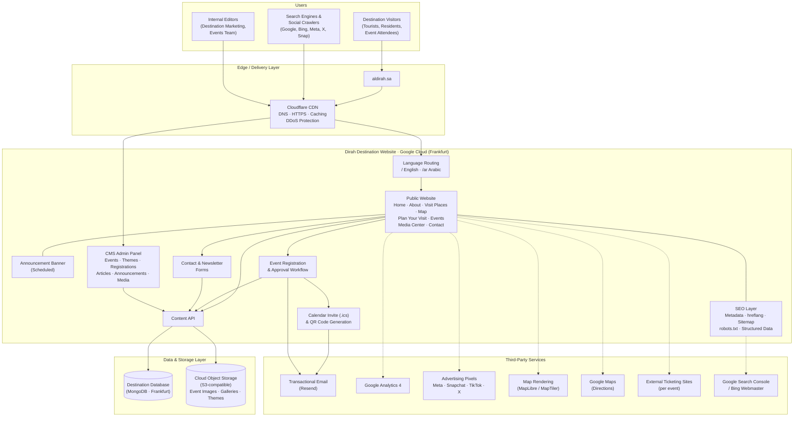
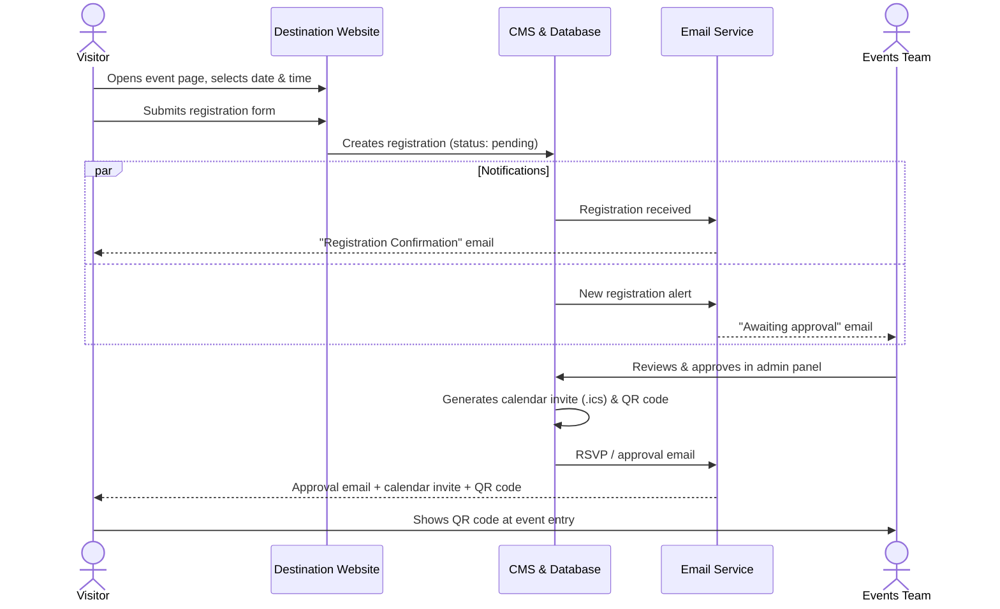
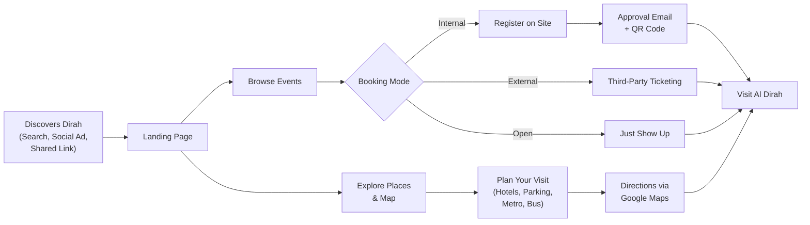
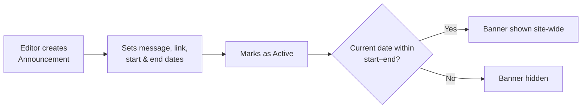
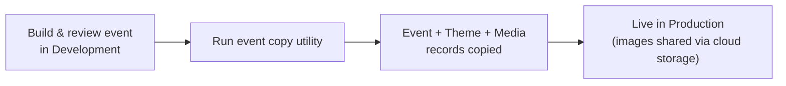
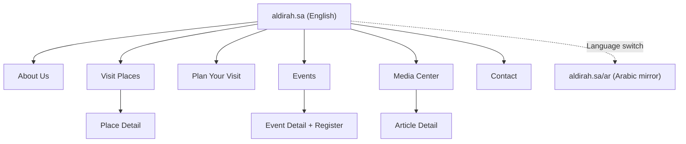
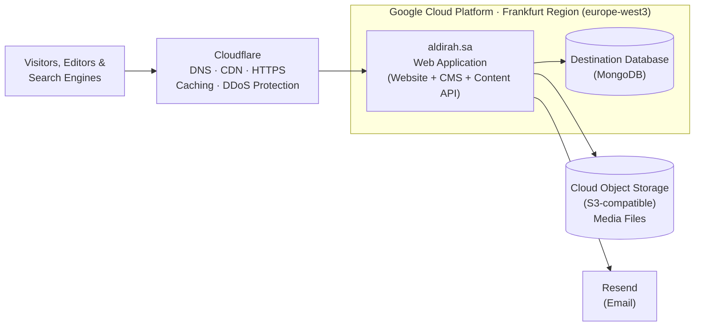
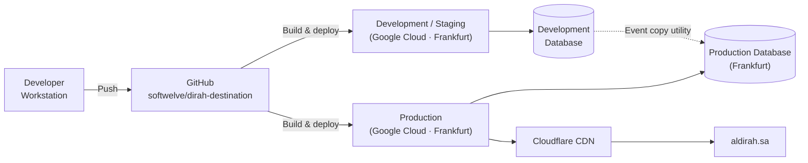

# Dirah Destination Website: Architecture Document

**Platform:** Dirah Destination Website (وجهة الديرة)
**Production Domain:** `aldirah.sa`
**Version:** 2.0

---

## 1. Purpose

This document describes the high-level architecture of the **Dirah Destination Website**. It covers what the platform does, its main building blocks, how content and data move through the system, the third-party services involved, security, and SEO.

It is written for stakeholders, project managers, marketing/SEO teams, and technical leads who need to understand the system without reading the code.

| Item | Details |
|---|---|
| **Owner** | Dirah Development Company, Al Dirah destination |
| **Audience** | Tourists, Riyadh residents, families, event attendees |
| **Content owners** | Destination Marketing, Events team |
| **Languages** | English and Arabic (right-to-left) |

---

## 2. Platform Overview

The Dirah Destination Website is the visitor-facing tourism and culture website for **Al Dirah**, the historic heart of Riyadh. It invites visitors to explore local culture through events, festivals, interactive experiences, heritage sites, and traditional markets. It also helps them plan their trip and sign up for events.

### 2.1 Key Capabilities

- **Landing page:** hero section, "Discover Dirah", places to visit, upcoming events
- **About Us:** the story and identity of the destination
- **Visit Places:** heritage sites, historical landmarks, traditional markets (e.g. Al Moaiqliah, Al Qiasareyah), restaurants, public spaces
- **Places-to-Visit detail pages**
- **Interactive district map:** points of interest and the destination boundary, with map controls
- **Plan Your Visit:** FAQs, hotels, parking, metro and bus stations, location buttons for directions
- **Events ("What's On"):** event listings, calendar-based date picker, event detail pages with galleries
- **Event registration:** booking form with an approval step, confirmation emails, calendar invites, and QR codes
- **Themed event pages:** each event can have its own colours and decorative artwork
- **Announcement banner:** site-wide banner that can be scheduled (e.g. Founding Day)
- **Media Center:** news articles with latest and grid views
- **Contact Us:** contact form
- **Newsletter:** email subscription
- **Marketing tracking:** Meta, Snapchat, TikTok, and X pixels for paid campaigns
- **Bilingual experience:** English/Arabic with mirrored RTL layout
- **CMS admin panel:** where internal teams manage content, events, and registrations

---

## 3. High-Level Architecture Diagram

**Legend:** Solid arrows are core request and data flows. Dotted arrows are browser-side or reporting integrations.

---

## 4. Architectural Layers

The Destination Website is a **single, self-contained web application**. One deployment serves the public website, the content API, and the CMS admin panel, backed by its own database.

| Layer | Responsibility |
|---|---|
| **Delivery (Edge)** | Cloudflare CDN: DNS, HTTPS, caching, and DDoS protection. The application adds security headers to every response |
| **Language Routing** | English is served at the root (`/...`) and Arabic under `/ar/...`, each with its own page layout, language tag, and text direction |
| **Presentation** | Responsive, bilingual pages with mirrored RTL layout, custom brand typography, animations, and carousels |
| **Announcement Layer** | Shows the active, in-date announcement banner across the site |
| **Interactive Map** | District map with points of interest and destination boundary |
| **SEO Layer** | Page titles, descriptions, social previews, language alternates, sitemap, robots rules, structured data |
| **Event Registration** | Takes bookings, runs the approval process, and sends confirmations |
| **Content Management (CMS)** | Web-based admin panel for staff to manage content without developers |
| **Content API** | Internal service the website and CMS use to read and write content |
| **Data** | Dedicated MongoDB database in the Google Cloud Frankfurt region |
| **File Storage** | S3-compatible cloud storage for event images, galleries, and theme artwork |
| **Integrations** | Email, analytics, advertising pixels, maps |

### 4.1 Technology Summary (Non-Technical View)

| Concern | Choice | Why it matters |
|---|---|---|
| Web framework | Next.js (React), a modern server-rendering framework | Fast pages that search engines can read |
| CMS | Payload CMS, built into the same application | One system to host, and editors get a user-friendly admin panel |
| Database | MongoDB (Frankfurt region) | Flexible storage for multilingual event content, close to the application |
| Media storage | S3-compatible object storage | Scalable, durable image hosting |
| Email | Resend (sender: `destination@aldirah.sa`) | Reliable delivery of confirmations and approvals |
| Maps | MapLibre (open-source) with MapTiler tiles | Custom-styled interactive map with no per-view Google Maps fees |
| Calendar invites | Standard ICS files | Work with Google, Outlook, and Apple calendars |
| QR codes | Generated automatically per approved registration | Fast check-in at the event |
| Rich text | Built-in visual editor | Editors format event and article descriptions without HTML |
| CMS languages | English and Arabic admin interface | Arabic-speaking staff can use the admin panel |
| CDN | Cloudflare | Fast delivery from edge locations near visitors, HTTPS, and DDoS protection |
| Hosting | Google Cloud Platform (Frankfurt region) | Reliable, scalable cloud infrastructure |

---

## 5. Content Model (What Editors Manage)

| Content Area | Description | Bilingual | Publicly Visible |
|---|---|---|---|
| **Events** | Title (or title image), thumbnail, short and detailed descriptions, start/end dates, month, daily time window, location name with Google Maps link, main image (desktop and mobile), gallery, theme, status, display order, and booking mode | Yes | Yes |
| **Themes** | Visual identity per event: primary, background, and form colours; card and border artwork for English/Arabic and desktop/mobile | Yes | Yes |
| **Event Registrations** | Visitor bookings: event, name, email, phone, booked date and time, approval status | n/a | No (internal) |
| **Articles** | Media Center news with images and rich content | Yes | Yes |
| **Announcements** | Site-wide banner: icon, message, subtitle, link, active flag, start and end dates | Yes | Yes |
| **Contact Submissions** | Contact Us form entries | n/a | No (internal) |
| **Newsletter Subscribers** | Email sign-ups | n/a | No (internal) |
| **Media** | Image library | n/a | Yes |
| **Users** | CMS administrators and editors | n/a | No |

> **Note:** Places to visit, district map points and boundary, and Plan Your Visit information (FAQs, hotels, parking, metro and bus stations) are kept in the website's built-in content files. Changing them requires a website release.

### 5.1 Event Booking Modes

Each event has a booking mode, set in the CMS:

| Booking Mode | Visitor Experience |
|---|---|
| **Enabled (Internal Form)** | Visitor picks a date and time and registers on the website |
| **External URL** | Visitor is sent to a third-party ticketing or booking site |
| **No Registration Needed** | Event is shown as open entry |
| **Booking Closed** | Registration is disabled |

---

## 6. Key Business Flows

### 6.1 Event Registration and Approval Flow

### 6.2 Visitor Journey

### 6.3 Announcement Banner Flow

### 6.4 Event Promotion (Development → Production)

The team has a utility to copy one event from development to production, including its theme and all referenced images. A fully designed event can be reviewed first and then published without re-entering it.

---

## 7. Site Map and URL Structure

English is at the root, and Arabic is under `/ar`.

| Page | English URL | Arabic URL |
|---|---|---|
| Home | `/` | `/ar` |
| About Us | `/about-us` | `/ar/about-us` |
| Visit Places | `/visit-places` | `/ar/visit-places` |
| Place Detail | `/places-to-visit/{id}` | `/ar/places-to-visit/{id}` |
| Plan Your Visit | `/plan-your-visit` | `/ar/plan-your-visit` |
| Events | `/events` | `/ar/events` |
| Event Detail | `/events/{event-id}` | `/ar/events/{event-id}` |
| Media Center | `/media-center` | `/ar/media-center` |
| Article Detail | `/media-center/{article-id}` | `/ar/media-center/{article-id}` |
| Contact | `/contact` | `/ar/contact` |
| CMS Admin | `/admin` (login required) | n/a |

---

## 8. SEO Architecture

The Destination Website targets **tourism, culture, and events search**, such as "things to do in Riyadh", "Dirah events", "Riyadh heritage sites", and "traditional markets Riyadh", in English and Arabic. It also supports paid social campaigns with conversion tracking.

### 8.1 SEO Capability Summary

| SEO Feature | Status | Details |
|---|---|---|
| Server-rendered HTML | Partial | Home and layout pages are built on the server. Several listing and detail pages load content in the browser |
| Title template | Yes | `{Page} \| Dirah Destination` (EN) / `{Page} \| وجهة الديرة` (AR) |
| Default title | Yes | "Dirah Destination" / "وجهة الديرة" |
| Meta description | Yes | Bilingual destination description |
| Page-level titles | Yes | Set per page for Events, Visit Places, Plan Your Visit, About, Contact, Media Center, Place detail |
| Canonical URL | Partial | `/` (EN) and `/ar` (AR) at the layout level |
| hreflang alternates | Yes | `en` → `/`, `ar` → `/ar`, `x-default` → `/` |
| Open Graph | Yes | Title, description, URL, site name, locale `en_SA` / `ar_SA` |
| Twitter / X Card | Yes | Large image summary card |
| Robots meta | Yes | Index, follow |
| XML sitemap | Yes | Automatic at `/sitemap.xml`, with language alternates |
| robots.txt | Yes | Allows pages and assets, blocks admin, API, system, and test paths |
| Structured data | Yes | `Organization` and `WebSite` (with `SearchAction`), bilingual |
| `<html lang>` and `dir` | Yes | Separate English (LTR) and Arabic (RTL) layouts |
| Custom error pages | Yes | Custom 404 and 500 pages, plus "not found" for missing articles |
| Legacy URL redirects | Yes | `/handler/*` permanently redirected (301) |
| HTTPS and HSTS preload | Yes | 2-year HSTS with preload |
| Image optimisation | Yes | Automatic resizing and modern formats, with separate mobile and desktop images |
| Self-hosted fonts | Yes | Brand fonts served from the site |
| Analytics | Yes | Google Analytics 4 |
| Paid social tracking | Yes | Meta, Snapchat, TikTok, X pixels |

### 8.2 Structured Data

| Schema | Details | Purpose |
|---|---|---|
| `Organization` | Name "Dirah Destination" with Arabic alternate name "وجهة الديرة", logo, description, customer service contact point | Brand knowledge panel |
| `WebSite` | Bilingual name and alternate name, site URL | Site name in search results |
| `SearchAction` | Search URL template | Sitelinks search box (see recommendations) |

### 8.3 Sitemap Strategy

The sitemap combines fixed pages with live CMS content and lists every URL in both languages.

| Content | Priority | Change Frequency | Last-Modified Source |
|---|---|---|---|
| Home page | 1.0 | Daily | Generation time |
| Main sections (About Us, Events, Visit Places, Plan Your Visit, Media Center, Contact) | 0.8 | Weekly | Generation time |
| Places-to-Visit detail pages | 0.7 | Monthly | Generation time |
| Event detail pages | 0.6 | Weekly | CMS "updated" date (most recent across both languages) |
| Article detail pages | 0.6 | Weekly | CMS updated, published, or created date |

- English and Arabic content are fetched separately and merged, so an item appears even if it only exists in one language.
- Dynamic entries refresh **every hour**.
- Each CMS request stops after **8 seconds**. If the CMS is slow or unavailable, the sitemap still returns every fixed page.
- Local development environments skip dynamic fetching.

### 8.4 Crawl Control (robots.txt)

| Rule | Paths |
|---|---|
| **Allowed: static assets** | Favicon, images, icons, fonts, CSS, JS, SVG, PNG, JPG, WebP, GIF |
| **Allowed: pages (EN and AR)** | `/`, `/ar/`, `/about-us`, `/events`, `/visit-places`, `/plan-your-visit`, `/media-center`, `/contact` and their `/ar/` versions |
| **Disallowed** | `/admin/`, `/api/`, `/api/graphql`, `/api/graphql-playground`, `/_next/`, `/test-qr/` |
| **Crawl delay** | 1 second |
| **Sitemap** | `https://aldirah.sa/sitemap.xml` |

### 8.5 Social Sharing and Campaign Tracking

| Platform | Role | Tracking |
|---|---|---|
| **Meta (Facebook / Instagram)** | Link previews via Open Graph, paid campaigns | Meta Pixel (page views and events) |
| **Snapchat** | Paid campaigns (high reach in KSA) | Snapchat Pixel |
| **TikTok** | Paid campaigns | TikTok Pixel |
| **X (Twitter)** | Link previews via Twitter Card, paid campaigns | X Pixel |
| **WhatsApp** | Link previews via Open Graph | n/a |
| **Google** | Organic search | Google Analytics 4 |

The Content Security Policy only allows these tracking domains, so no unauthorised scripts can load.

---

## 9. Security Architecture

| Control | Description |
|---|---|
| **HTTPS everywhere** | All traffic is encrypted, and HSTS with preload forces secure connections for 2 years |
| **Content Security Policy** | Only approved domains (Google Analytics, ad pixels, map tiles, approved storage/CDN) can load scripts, images, frames, or receive data |
| **Clickjacking protection** | Pages can't be embedded in other sites' frames |
| **MIME-sniffing protection** | Browsers must honour declared file types |
| **XSS filter header** | Legacy browser cross-site scripting protection turned on |
| **Referrer policy** | Limits the URL information shared with external sites |
| **Permissions policy** | Camera, microphone, and geolocation are disabled |
| **CMS authentication** | Admin panel requires a login |
| **Approval control** | Only authenticated staff can approve or change event registrations |
| **Crawler exclusions** | Admin, API, and test paths are blocked in robots.txt |
| **Secrets management** | Database, storage, and email credentials are kept in environment configuration, not in source code |

> **Priority recommendation:** Event registration records (visitor names, emails, phone numbers) are currently **readable through the public content API**. Restrict read access to authenticated staff only, to protect visitor personal data and comply with Saudi Arabia's **Personal Data Protection Law (PDPL)**.

---

## 10. Hosting, Environments and Operations

### 10.1 Hosting Topology

### 10.2 Deployment Pipeline

### 10.3 Hosting Summary

| Aspect | Details |
|---|---|
| **CDN and edge** | Cloudflare: DNS, global content delivery, HTTPS, caching, and DDoS protection in front of the application |
| **Application hosting** | Google Cloud Platform, **Frankfurt region** (europe-west3) |
| **Database** | MongoDB, hosted in the **Frankfurt region** next to the application for low-latency access |
| **Request path** | Visitor → Cloudflare edge (nearest location) → Google Cloud Frankfurt → database (Frankfurt) |
| **Data residency** | Application and database data are stored in the EU (Germany) |
| **Source control** | GitHub (`softwelve/dirah-destination`) |
| **Environments** | Development/staging and production, each with its own database |
| **Deployments** | Built from the GitHub repository and deployed to Google Cloud |
| **Media** | S3-compatible object storage |
| **Content promotion** | Utility to copy one event (with theme and media) from development to production |
| **Email** | Resend, sending from `destination@aldirah.sa` |
| **Monitoring** | Google Analytics 4 (traffic), ad platform dashboards (campaigns), Cloudflare analytics (traffic and threats), Google Cloud logging (errors) |
| **Backups** | Handled by the managed database and Google Cloud services (confirm retention policy) |

---

## 11. Integrations Summary

| Service | Purpose | Data Shared |
|---|---|---|
| **Cloudflare** | DNS, CDN, HTTPS, caching, DDoS protection | All website traffic passes through it |
| **Google Cloud Platform (Frankfurt)** | Application and database hosting | All application data |
| **MongoDB (Frankfurt)** | Content, events, and registration storage | All CMS content and form data |
| **S3-compatible storage** | Event images, galleries, theme artwork | Uploaded files |
| **Resend** | Registration confirmations, admin alerts, RSVP approvals | Visitor name, email, event details, calendar invite, QR code |
| **Google Analytics 4** | Traffic and behaviour analytics | Anonymous usage data |
| **Meta Pixel** | Paid campaign attribution | Page views and conversion events |
| **Snapchat Pixel** | Paid campaign attribution | Page views and conversion events |
| **TikTok Pixel** | Paid campaign attribution | Page views and conversion events |
| **X Pixel** | Paid campaign attribution | Page views and conversion events |
| **MapLibre / MapTiler** | Interactive district map | Map tile requests |
| **Google Maps** | Directions to event and place locations | Opened by the visitor |
| **External ticketing sites** | Bookings for events using the External URL mode | Visitor is redirected |

---

## 12. Glossary

| Term | Meaning |
|---|---|
| **CMS** | Content Management System: the admin panel where staff edit website content |
| **CDN** | Content Delivery Network: servers worldwide that deliver the site quickly to visitors |
| **Canonical URL** | Tells search engines which URL is the "master" version of a page |
| **hreflang** | Tells search engines which language version of a page to show each user |
| **x-default** | The fallback language version for users whose language isn't supported |
| **Sitemap** | A file listing all site pages so search engines can find them |
| **robots.txt** | A file telling search engines which areas they may or may not crawl |
| **Structured Data / Schema.org** | Hidden labels that help search engines understand content (events, places, organisations) and show rich results |
| **Open Graph** | Tags that control how links look when shared on social media and messaging apps |
| **Pixel** | A small tracking script from an ad platform that measures campaign results |
| **ICS** | A standard calendar invite file that works with Google, Outlook, and Apple calendars |
| **QR Code** | A scannable code emailed to approved attendees for event check-in |
| **RTL** | Right-to-left text direction, used for Arabic |
| **PDPL** | Saudi Arabia's Personal Data Protection Law |
| **HSTS** | A security setting that forces browsers to always use HTTPS |
| **301 Redirect** | A permanent redirect that passes SEO value to the new URL |
