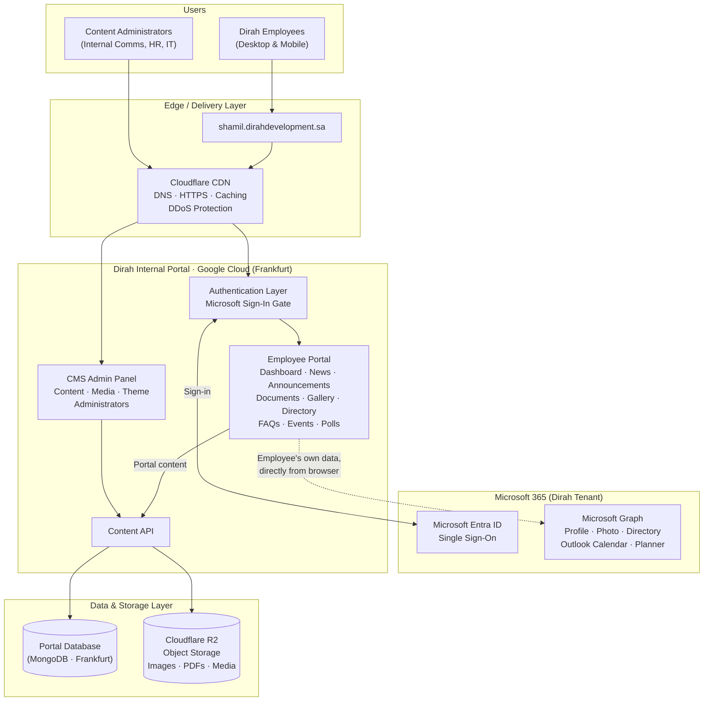
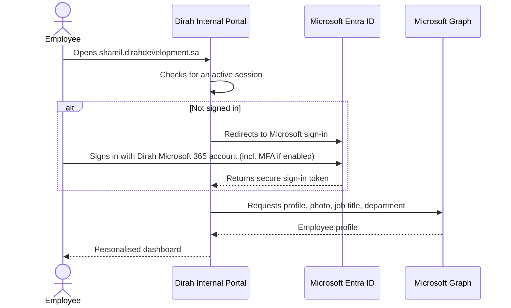
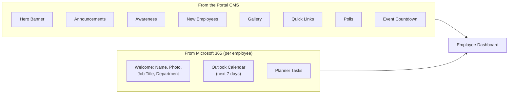
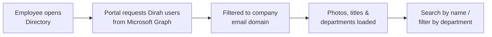
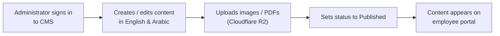
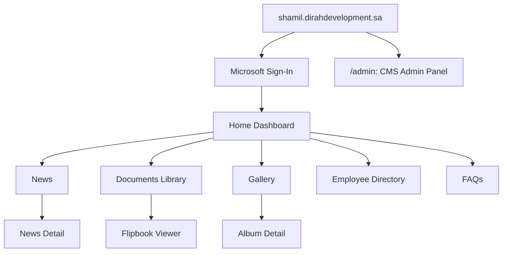
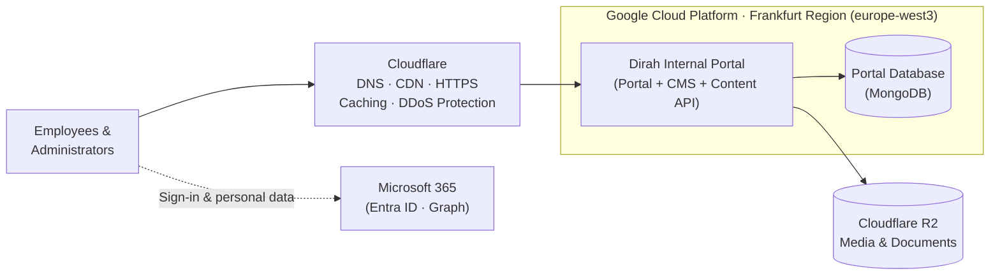
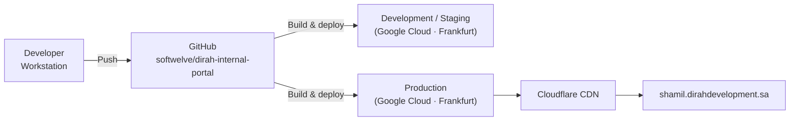

# Dirah Internal Portal: Architecture Document

**Platform:** Dirah Internal Portal (Employee Intranet)
**Production Domain:** `shamil.dirahdevelopment.sa`
**Status:** Live
**Version:** 4.0
**Date:** 14 September 2026

---

## 1. Purpose

This document describes the high-level architecture of the **Dirah Internal Portal**, the employee intranet for Dirah Development Company. It covers what the platform does, its main building blocks, how employees sign in, how content and data move through the system, the integrations with Microsoft 365, security, and hosting.

It is written for stakeholders, IT teams, internal communications teams, and technical leads who need to understand the system without reading the code.

| Item | Details |
|---|---|
| **Owner** | Dirah Development Company |
| **Audience** | All Dirah employees |
| **Content owners** | Internal Communications, HR, IT |
| **Access** | Employees only, through Microsoft 365 sign-in |
| **Languages** | English and Arabic (right-to-left) |

---

## 2. Platform Overview

The Dirah Internal Portal is the company's digital workplace. It is a single place where employees see company news, announcements, documents, and events, and reach their Microsoft 365 calendar, tasks, and colleagues.

### 2.1 Key Capabilities

- **Personalised home dashboard:** a welcome message with the employee's name, photo, job title, and department
- **Announcements:** company-wide notices with images and dates
- **News:** internal news with a detail page for each article
- **Awareness:** awareness and campaign content (e.g. security, health, compliance)
- **Events and countdown:** upcoming company events with a live countdown
- **My Calendar:** the employee's Outlook meetings for the coming week
- **My Tasks:** the employee's Microsoft Planner tasks
- **Employee Directory:** searchable directory of colleagues with photos, job titles, and departments, filterable by department
- **New Employee Welcome:** spotlight on new joiners with photo, title, department, and a welcome message
- **Documents library:** policies and company documents organised by category, with search, PDF thumbnails, and a page-turning flipbook viewer
- **Photo Gallery:** event albums with a full-screen lightbox viewer
- **FAQs:** frequently asked questions grouped by category
- **Quick Links:** shortcuts to frequently used business systems
- **Polls:** bilingual employee polls with optional live results
- **Light and dark mode:** follows the employee's device setting, or can be switched manually
- **Bilingual experience:** English/Arabic with a language switcher and right-to-left layout
- **Content Management System (CMS):** admin panel where content teams manage the portal without developers

---

## 3. High-Level Architecture Diagram

**Legend:** Solid arrows are core request and data flows. The dotted arrow is personal Microsoft 365 data that the employee's browser fetches directly from Microsoft, using the employee's own sign-in.

---

## 4. Architectural Layers

The Dirah Internal Portal is a **single, self-contained web application**. One deployment serves the employee portal, the content API, and the CMS admin panel, backed by its own database.

| Layer | Responsibility |
|---|---|
| **Delivery (Edge)** | Cloudflare CDN: DNS, HTTPS, caching of static assets, and DDoS protection |
| **Authentication** | Employees sign in with their Dirah Microsoft 365 account through Microsoft Entra ID single sign-on |
| **Presentation** | Responsive, bilingual employee portal with RTL support, light/dark mode, and a collapsible sidebar |
| **Microsoft 365 Integration** | Pulls the signed-in employee's profile, photo, calendar, tasks, and the company directory from Microsoft Graph |
| **Content Management (CMS)** | Web-based admin panel for managing portal content, media, and widget colours |
| **Content API** | Internal service the portal and CMS use to read and write content |
| **Data** | Dedicated MongoDB database in the Google Cloud Frankfurt region |
| **File Storage** | Cloudflare R2 object storage for images, PDFs, and gallery photos |

### 4.1 Technology Summary

| Concern | Choice | Why it matters |
|---|---|---|
| Web framework | Next.js (React) | Fast, modern, responsive portal |
| CMS | Payload CMS, built into the same application | One system to host, and editors get a user-friendly admin panel |
| Identity | Microsoft Entra ID (Microsoft Authentication Library) | Employees use their existing Microsoft 365 account with no separate password |
| Productivity data | Microsoft Graph API | Live Outlook calendar, Planner tasks, and directory inside the portal |
| Database | MongoDB (Frankfurt region) | Flexible storage for bilingual content, close to the application |
| Media storage | Cloudflare R2 | Durable, scalable storage for images and documents |
| Document viewer | Flipbook viewer | Page-turning reading experience for PDFs |
| UI components | Accessible component library with light/dark themes | Consistent, accessible interface |
| CDN | Cloudflare | Fast delivery, HTTPS, and DDoS protection |
| Hosting | Google Cloud Platform (Frankfurt region) | Reliable, scalable cloud infrastructure |

---

## 5. Content Model (What Administrators Manage)

| Content Area | Description | Bilingual |
|---|---|---|
| **Announcements** | Subject, image, date, publish status | Yes |
| **News** | Internal news articles with images and detail pages | Yes |
| **Awareness** | Awareness campaign content with image and date | Yes |
| **Events** | Event name, date, start and end time, description, location | Yes |
| **New Employees** | New joiner photo, name, title, department, welcome words | Yes |
| **Documents** | Document name, category, and PDF file | Yes |
| **Document Categories** | Groups for organising the documents library | Yes |
| **FAQs** | Questions and answers | Yes |
| **FAQ Categories** | Groups for organising FAQs | Yes |
| **Gallery** | Photo albums with multiple images | Yes |
| **Quick Links** | Title, icon, and destination URL for business system shortcuts | Yes |
| **Polls** | Bilingual question and options, vote counts, show-results setting, poll date, status | Yes |
| **Hero Image** | Dashboard banner image | n/a |
| **Theme Configuration** | Colours for each dashboard widget (calendar, planner, announcements, awareness, gallery, quick links, buttons), chosen from preset colours or a custom picker | n/a |
| **Patterns** | Decorative brand patterns used in the portal design | n/a |
| **Media** | Central image and file library | n/a |
| **Administrators** | CMS administrator accounts | n/a |

Most content types have a **publish status**, so administrators can prepare content in draft before it appears to employees.

---

## 6. Key Flows

### 6.1 Employee Sign-In Flow

### 6.2 Dashboard Composition

When an employee opens the dashboard, content comes from two sources at the same time:

| Data Source | Loaded By | Refresh |
|---|---|---|
| Portal content (CMS) | The portal server, when the page is built | Every visit |
| Personal Microsoft 365 data | The employee's browser, directly from Microsoft, using the employee's own permissions | Live on each visit |

Calendar and task data are **never stored** in the portal database. They are read live from Microsoft 365 for the signed-in employee only.

### 6.3 Employee Directory Flow

### 6.4 Content Publishing Flow

---

## 7. Portal Structure

| Section | Path |
|---|---|
| Home Dashboard | `/` |
| News | `/news` |
| News Detail | `/news/{id}` |
| Documents | `/documents` |
| Gallery | `/gallery` |
| Album Detail | `/gallery/{id}` |
| Employee Directory | `/employees` |
| FAQs | `/faqs` |
| CMS Admin Panel | `/admin` |

---

## 8. Microsoft 365 Integration

The portal connects to Dirah's Microsoft 365 tenant through a registered application in Microsoft Entra ID.

| Capability | Microsoft Permission | Used For |
|---|---|---|
| Sign in and read own profile | `User.Read` | Name, email, photo, job title, department |
| Read own tasks | `Tasks.Read` | Microsoft Planner tasks widget |
| Read own calendar | `Calendars.Read` | Outlook upcoming meetings widget |
| Read company users | `User.Read.All` | Employee directory and colleague photos |
| Read directory | `Directory.Read.All` | Departments and organisational details |
| Read SharePoint sites | `Sites.Read.All` | Access to company SharePoint content |

All Microsoft data is requested **on behalf of the signed-in employee**, so Microsoft 365's own permission model always applies.

---

## 9. Security Architecture

| Control | Description |
|---|---|
| **Single sign-on** | Employees sign in with their corporate Microsoft 365 account, and company sign-in policies (including multi-factor authentication and conditional access) apply automatically |
| **No stored passwords for employees** | The portal never sees or stores employee passwords |
| **Delegated access** | Microsoft 365 data is read with the employee's own permissions and is never cached in the portal database |
| **Separate administrator access** | The CMS admin panel requires a separate administrator login |
| **HTTPS everywhere** | All traffic is encrypted, and HSTS with preload forces secure connections for 2 years |
| **Content Security Policy** | Only approved domains (Microsoft sign-in, Microsoft Graph, approved storage) can load scripts, images, or receive data |
| **Clickjacking protection** | Portal pages can't be embedded in other websites |
| **MIME-sniffing protection** | Browsers must honour declared file types |
| **Referrer policy** | Limits the URL information shared with external sites |
| **Permissions policy** | Camera, microphone, and geolocation are disabled |
| **DDoS protection** | Cloudflare filters malicious traffic before it reaches the application |
| **Secrets management** | Database, storage, and Microsoft application credentials are kept in secure environment configuration, not in source code |

---

## 10. Hosting, Environments and Operations

### 10.1 Hosting Topology

### 10.2 Deployment Pipeline

### 10.3 Hosting Summary

| Aspect | Details |
|---|---|
| **CDN and edge** | Cloudflare: DNS, content delivery, HTTPS, caching, and DDoS protection |
| **Application hosting** | Google Cloud Platform, Frankfurt region (europe-west3) |
| **Database** | MongoDB, Frankfurt region, next to the application |
| **Media and documents** | Cloudflare R2 object storage |
| **Identity provider** | Microsoft Entra ID (Dirah Microsoft 365 tenant) |
| **Request path** | Employee → Cloudflare edge → Google Cloud Frankfurt → database (Frankfurt) |
| **Source control** | GitHub (`softwelve/dirah-internal-portal`) |
| **Environments** | Development/staging and production |
| **Deployments** | Built from the GitHub repository and deployed to Google Cloud |
| **Monitoring** | Cloudflare analytics (traffic and threats) and Google Cloud logging (application health and errors) |

---

## 11. Integrations Summary

| Service | Purpose | Data Involved |
|---|---|---|
| **Microsoft Entra ID** | Employee single sign-on | Sign-in token |
| **Microsoft Graph** | Profile, photo, calendar, Planner tasks, directory | Read live per employee, not stored |
| **MongoDB (Frankfurt)** | Portal content storage | CMS content, polls, configuration |
| **Cloudflare R2** | File storage | Images, PDFs, gallery photos |
| **Cloudflare** | DNS, CDN, HTTPS, DDoS protection | All portal traffic |
| **Google Cloud Platform (Frankfurt)** | Application and database hosting | All application data |

---

## 12. Glossary

| Term | Meaning |
|---|---|
| **Intranet** | A private website for a company's employees |
| **CMS** | Content Management System: the admin panel where administrators manage portal content |
| **CDN** | Content Delivery Network: servers worldwide that deliver the portal quickly |
| **Microsoft Entra ID** | Microsoft's identity service (formerly Azure Active Directory) that handles corporate sign-in |
| **Single Sign-On (SSO)** | Signing in once with a corporate account to reach multiple systems |
| **Microsoft Graph** | Microsoft's API for reading Microsoft 365 data such as calendars, tasks, and users |
| **MFA** | Multi-factor authentication: a second verification step at sign-in |
| **Delegated permissions** | Access granted on behalf of the signed-in user, limited to what that user may see |
| **Flipbook** | A document viewer that shows PDFs with realistic page-turning |
| **Cloudflare R2** | Cloudflare's object storage service for files |
| **RTL** | Right-to-left text direction, used for Arabic |
| **HSTS** | A security setting that forces browsers to always use HTTPS |
