# Shamil Integrated Internal Portal: Architecture Document

**Platform:** Shamil Integrated Internal Portal (Multi-Tenant Employee Portal)
**Group:** Riyadh Holding and portfolio companies
**Version:** 1.0
**Date:** 14 September 2026

---

## 1. Purpose

This document describes the high-level architecture of the **Shamil Integrated Internal Portal**. Shamil is a single, shared employee platform that serves several group companies. Each company gets its own branded portal, and its data is kept separate from the others.

The document covers the platform's capabilities, multi-tenant design, identity and permissions, service management (Etmam), shared services analytics, integrations, security, and hosting.

It is written for stakeholders, IT leadership, shared services teams, and technical leads who need to understand the system without reading the code.

| Item | Details |
|---|---|
| **Owner** | Riyadh Holding Company |
| **Audience** | Employees, line managers, department heads, shared services teams, and administrators across group companies |
| **Access** | Employees only, through Microsoft 365 sign-in |
| **Languages** | English and Arabic (right-to-left) |

---

## 2. Tenants (Group Companies)

Shamil runs **one application and one database** for all companies. The company whose portal is shown is identified by the **web address** used to open it.

| Tenant | Company | Arabic Name | Portal Address | Status |
|---|---|---|---|---|
| **RHC** | Riyadh Holding | الرياض القابضة | `shamil.riyadhholding.sa` | Live |
| **Marafid** | Marafid | مرافد | `shamil.marafid.sa` | Live |
| **KAGA** | KAGA | كاجا | `shamil.kaga.sa` | Live |
| **Dirah** | Dirah Development | ديرة | `multi-tenant-ip.softwelve.com` | Pending go-live approval |

> Dirah currently uses its standalone **Dirah Internal Portal** (`shamil.dirahdevelopment.sa`). The Dirah tenant on Shamil is fully set up and awaiting approval to go live.

Each tenant has:

- **Its own branding:** logo, brand colours, navigation bar style, browser tab title, favicon, hero banner, and background artwork
- **Its own dashboard layout:** company-specific home screen designs (e.g. dedicated Dirah, Marafid, and KAGA dashboards)
- **Its own data:** news, documents, requests, inventory, and so on, visible only to that company's employees
- **Its own email sender:** notifications go out from the company's own email address
- **Its own email domain mapping:** employees are matched to their company automatically by email domain

---

## 3. Platform Overview

### 3.1 Employee Workplace (Intranet)

- **Personalised home dashboard:** welcome hero with the employee's name, photo, job title, and department
- **Announcements** with a scheduled announcement banner
- **News**, with a detail page for each article
- **Awareness** campaigns
- **Photo Gallery** with a full-screen viewer
- **Documents library** by category, with search, PDF thumbnails, and a flipbook viewer
- **FAQs** by category
- **Quick Links** to enterprise systems (e.g. IT service management, visitor management, employee self-service)
- **Favourite Apps** shortcuts
- **New Employee Welcome** and **Work Anniversaries**, with automatic anniversary greeting emails
- **Meeting Schedule**
- **Notifications** centre
- **My Calendar** (Outlook) and **My Tasks** (Microsoft Planner), live from Microsoft 365
- **Employee Directory**, from Microsoft 365
- **Global Search** across news, FAQs, quick links, documents, awareness, announcements, and gallery
- **Portal Launcher:** shown when the portal is opened from an address not linked to a company, so the user can choose their group company's portal

### 3.2 Business Applications

| Module | Purpose |
|---|---|
| **Etmam: IT and Service Request Centre (ITSM)** | Employees raise service requests through dynamic forms, which go through configurable approval workflows, fulfilment, SLA tracking, and satisfaction ratings |
| **Legal Requests** | Dedicated request centre for legal service requests, with their own forms and workflows |
| **ITSM Dashboard** | Operational view of request volumes, statuses, and SLA performance |
| **Inventory (Asset Management)** | Company assets by type, with status history, assignment history, links to requests, annotated notes, and per-type permissions |
| **Procurement Data** | Searchable catalogue of procurement items (item, department, category, chapter, type, UPC code, status) |
| **SSP Dashboard: Shared Services Performance** | Executive dashboard for shared services performance, published by uploading HTML dashboard files. Live integration with Microsoft Dynamics 365 is planned |
| **Permissions Tool** | Central management of employees, groups, roles, permissions, and audit logs |
| **Form Builder and Workflow Builder** | Visual, drag-and-drop tools to design request forms and approval workflows without developers |

---

## 4. High-Level Architecture Diagram

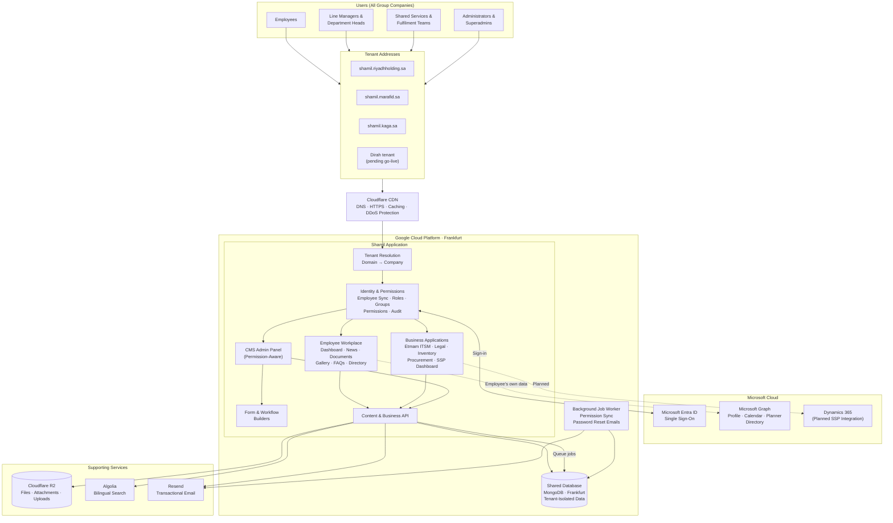

**Legend:** Solid arrows are server-side flows. The dotted arrow to Microsoft Graph is personal Microsoft 365 data that the employee's browser fetches directly from Microsoft, using the employee's own sign-in. The dotted arrow to Dynamics 365 is a planned future integration.

---

## 5. Multi-Tenant Architecture

### 5.1 How a Tenant Is Identified

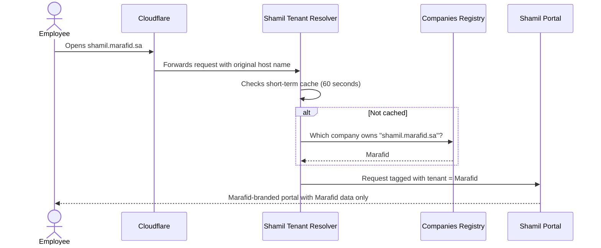

### 5.2 Companies Registry

Each group company is a record in the **Companies** registry, managed by superadmins:

| Field | Purpose |
|---|---|
| **Name / Slug** | Company display name and identifier |
| **Tenant Slug** | Tenant key (e.g. `rhc`, `marafid`, `kaga`, `dirah`) |
| **Domain** | Portal web address that routes to this tenant |
| **Email Domain** | Used to match employees to their company at sign-in |
| **From Email** | Sender address for this company's notifications |
| **Website** | Company's public website |

### 5.3 Data Isolation Model

Every business record (news, documents, requests, inventory, employees, and so on) is **tagged with the company it belongs to**. The tag is added automatically when the record is created.

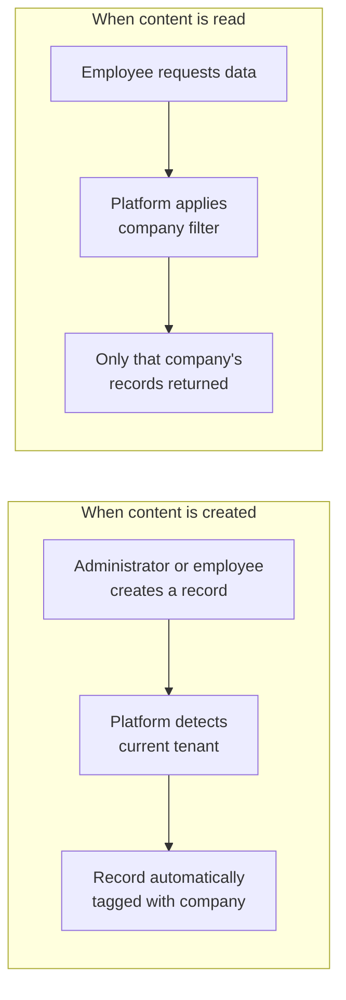

| Scenario | What the User Sees |
|---|---|
| Employee on their company's portal | Only their company's data |
| Unknown or unregistered portal address | No data |
| Superadmin | All companies' data, for group-wide administration |

**Tenant-isolated areas:** Announcements, News, Gallery, FAQs and FAQ Categories, Quick Links, Favourite Apps, Awareness, Documents and Document Categories, New Employees, Anniversaries, Notifications, Hero Images, Meeting Schedule, Events, Polls, Procurement Data, Media, Employees, Departments, ITSM Categories, ITSM Forms, ITSM Requests, Inventory, and Inventory Types.

### 5.4 Environment Separation

Records are also tagged by **environment** (development or production). Each deployment shows only content for its own environment, so test content never appears in the live portal, even when the underlying infrastructure is shared.

---

## 6. Identity, Access and Permissions

### 6.1 Employee Sign-In and Synchronisation

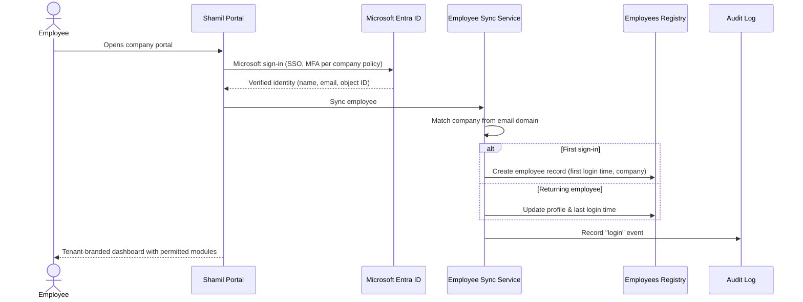

**Employees are the users** of both the portal and the admin panel. There are no separate accounts. Each employee record holds:

| Field | Purpose |
|---|---|
| **Microsoft Object ID** | Link to the Microsoft Entra ID identity |
| **Employee ID, Email, Display Name** | Identification |
| **Job Title, Department, Office Location** | Organisational details |
| **Line Manager** | Used for approval routing |
| **Company** | Tenant membership |
| **Status** | Active / inactive |
| **First and Last Login** | Activity tracking |
| **Groups, Roles, Custom Permissions** | Access control |
| **Admin Panel Access** | Whether the employee may open the CMS admin panel |

### 6.2 Permission Model

Access follows a **role-based access control (RBAC)** model with groups and fine-grained permissions:

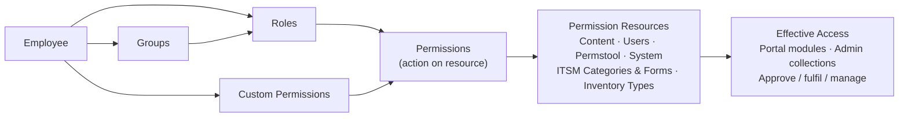

| Concept | Description |
|---|---|
| **Permission** | An action (e.g. read, create, manage) on a resource |
| **Permission Resource** | Something that can be protected: content areas, users, system settings, each ITSM category and form, each inventory type |
| **Role** | A named set of permissions (e.g. Superadmin, Content Manager, IT Fulfiller) |
| **Group** | A set of employees who share roles |
| **Custom Permission** | A permission granted directly to one employee |
| **Superadmin** | Full, group-wide access across all tenants |

**Automatic permission provisioning:** when a new ITSM category, ITSM form, or inventory type is created, the platform creates its permission resources in the background, and removes them when the item is deleted.

**Permission-aware admin panel:** employees only see the admin sections they have permission to manage. System areas such as the background jobs queue are visible to superadmins only.

### 6.3 Audit Logging

All security-relevant and data-changing activity is recorded in a central **Audit Log**:

| Category | Events Recorded |
|---|---|
| **Authentication** | Login, logout, password reset, account lock/unlock |
| **Data changes** | Create, update, and delete on every collection, with before and after values |
| **Access** | Read, access denied, page visits |
| **Permissions** | Permission grant and revoke, role assign and remove, group add and remove |
| **Data movement** | Data export and import |

Each entry records **who** (employee, email, Microsoft ID), **what** (action and target record), **where** (resource), **result** (success, failure, error, denied), **severity**, **IP address**, and **timestamp**. Audit logs can be viewed in the Permissions Tool and exported.

---

## 7. Etmam: Service Request Management (ITSM)

### 7.1 Overview

Etmam is the group's service request centre. Administrators design request forms and approval workflows visually. Employees submit requests, and approvers and fulfilment teams process them against service level agreements (SLAs).

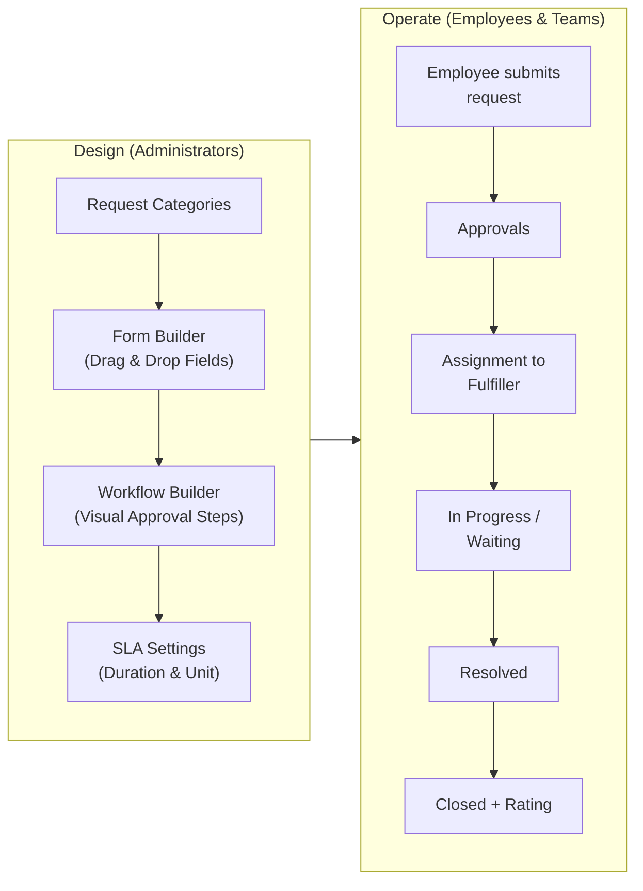

### 7.2 Request Lifecycle

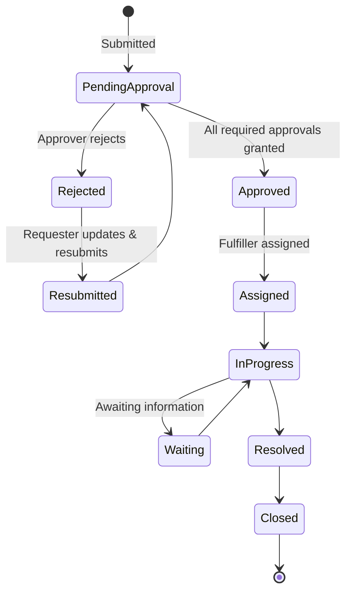

| Attribute | Options |
|---|---|
| **Priority** | Low, Medium, High, Urgent |
| **Status** | Pending Approval, Approved, Rejected, Assigned, In Progress, Waiting, Resubmitted, Resolved, Closed |
| **Request data** | Form answers, attachments, comments with attachments, full timeline of actions |
| **Tracking** | Unique request ID, submitting company, requester, assignee, submission time, SLA due time |

### 7.3 Approval Workflows

Workflows support **step-by-step approvals** with three kinds of approver:

| Approver Type | Resolved From |
|---|---|
| **Line Manager** | The requester's line manager in the employee registry |
| **Department Head** | The head of the requester's department |
| **Role-Based** | Any employee holding a specified role (e.g. IT Approver, Legal Reviewer) |

**Approval rules enforced by the platform:**

- Only the approver eligible for the **current step** can approve or reject.
- Steps run **in sequence**. Later steps unlock only after earlier steps are approved.
- An approver can **never act twice on the same step**, but may act on a later step if they are also eligible for it.
- If the line manager and department head are **the same person**, a single approval satisfies both.
- Role-based steps stay **independent**, even if the same person is also a line manager.
- Requesters can **never approve their own requests**.
- These rules are enforced on the server, whatever the user interface shows.

### 7.4 SLA Management

| Feature | Description |
|---|---|
| **SLA per form** | Each request type can have its own SLA duration |
| **Business-time calculation** | SLA due dates skip weekends and **Saudi Arabia public holidays** |
| **Saudi timezone** | All SLA calculations use Riyadh time (GMT+3) |
| **Reminders** | Reminder notifications can be sent on outstanding requests |
| **Reporting** | SLA compliance shown in the ITSM Dashboard |

### 7.5 Notifications and Ratings

- **Email notifications** at every key stage: request submitted, approval required, approved, rejected, information needed, ready for fulfilment, assigned to you, new comment, status updated, priority changed, and resolved. They are sent from the tenant company's own email address.
- **Satisfaction ratings** once a request is resolved, kept as permanent feedback records for each resolver and form.
- **Inventory linking:** assets can be assigned to requests (e.g. laptop provisioning), and the asset's assignment history updates automatically.

---

## 8. Inventory (Asset Management)

| Capability | Description |
|---|---|
| **Inventory Types** | Configurable asset types (e.g. laptops, phones, access cards), each with its own permissions |
| **Asset records** | Identifier, type, status, description, metadata |
| **Status history** | Every status change with who changed it, when, and why |
| **Assignment history** | Full record of which request and employee an asset was assigned to, with snapshots of the request |
| **Linked requests** | Direct link between an asset and the Etmam request that uses it |
| **Visual annotations** | Position-based notes and threaded replies on an asset's blueprint/image, with resolve tracking |
| **Search** | Permission-aware asset search |

---

## 9. SSP Dashboard: Shared Services Performance

### 9.1 Overview

The SSP Dashboard gives executives and shared services leadership one view of shared services performance across group companies. It is delivered **inside the portal**, so it uses the same Microsoft sign-in, tenant branding, and permissions as the rest of Shamil.

### 9.2 Current Delivery: HTML Dashboard Upload

Dashboards are currently prepared outside the portal and **published by uploading an HTML dashboard file**. Authorised administrators upload the file, and the portal shows it to permitted users.

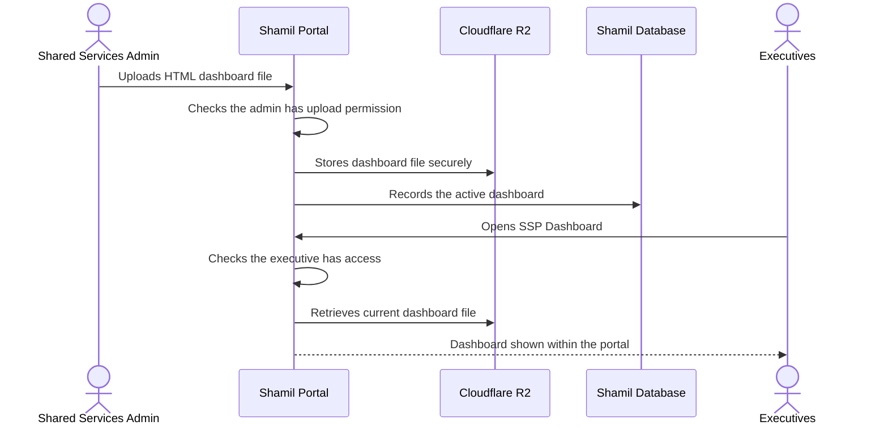

| Aspect | Details |
|---|---|
| **Publishing** | HTML dashboard file uploaded by authorised administrators |
| **Updating** | Uploading a new file replaces the dashboard employees see |
| **Storage** | Cloudflare R2 |
| **Access** | Limited to employees with SSP Dashboard permissions |
| **Experience** | Shown within the portal, with the portal's navigation and branding |

### 9.3 Planned: Microsoft Dynamics 365 Integration

The SSP Dashboard will be integrated with **Microsoft Dynamics 365**. Performance data will then come directly from D365, replacing manual HTML uploads with up-to-date figures.

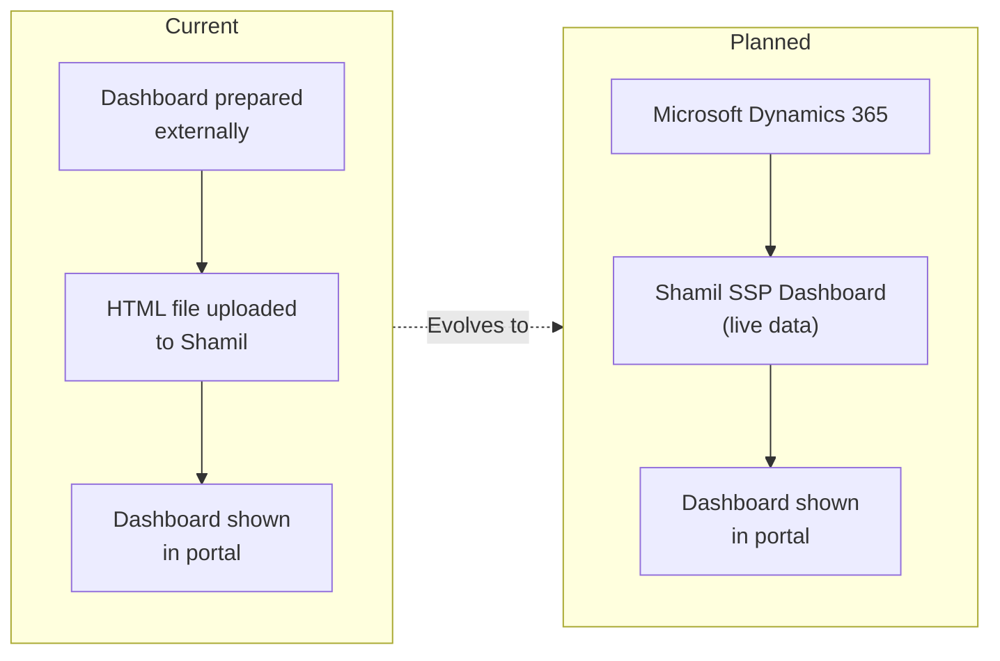

---

## 10. Background Processing

A **dedicated background job worker** runs alongside the portal on Google Cloud in Frankfurt. It works through a job queue, so long-running tasks never slow down employees.

| Job | Trigger | Purpose |
|---|---|---|
| **ITSM Category Permissions Sync** | Category created/updated/deleted | Create or remove the category's permission resources |
| **ITSM Form Permissions Sync** | Form created/updated/deleted | Create or remove the form's permission resources |
| **Inventory Type Permissions Sync** | Inventory type created/deleted | Create or remove the type's permission resources |
| **Employee Password Reset** | Administrator request | Send password reset email to the employee |

---

## 11. Search

Shamil provides **bilingual global search**, powered by Algolia.

| Searchable Content | Fields Indexed (English and Arabic) |
|---|---|
| News | Title, description |
| FAQs | Question, answer |
| Quick Links | Title |
| Documents | Name |
| Awareness | Content, description |
| Announcements | Subject |
| Gallery | Title, description |

Search indexes update automatically whenever content is created, updated, or deleted.

---

## 12. Content Model Summary

| Group | Collections |
|---|---|
| **Workplace content** | Announcements, News, Awareness, Gallery, Documents, Document Categories, FAQs, FAQ Categories, Quick Links, Favourite Apps, New Employees, Anniversaries, Meeting Schedule, Notifications, Events, Polls |
| **Branding** | Hero Images, Hero Backgrounds, Theme Configuration, Patterns |
| **Media** | Media library |
| **Organisation** | Companies, Departments, Employees |
| **Access control** | Employee Groups, Employee Roles, Permissions, Permission Resources, Audit Logs |
| **Service management** | ITSM Categories, ITSM Forms, ITSM Requests, ITSM Ratings |
| **Assets** | Inventory Types, Inventory |
| **Procurement** | Procurement Data |
| **Dashboards** | Dashboard HTML Files |

Content is **bilingual** (English and Arabic), and most collections support **bulk import and export** from the admin panel.

---

## 13. Portal Structure

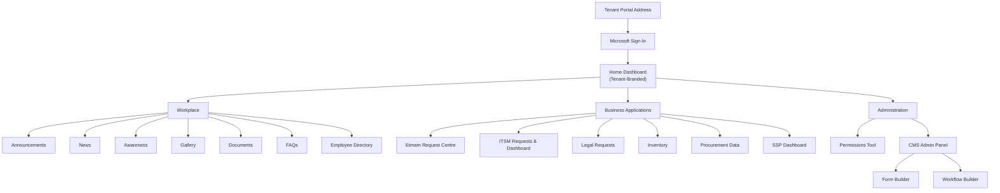

| Section | Path |
|---|---|
| Home Dashboard | `/` |
| Announcements | `/announcements` |
| News | `/news`, `/news/{id}` |
| Awareness | `/awareness`, `/awareness/{id}` |
| Gallery | `/gallery`, `/gallery/{id}` |
| Documents | `/documents` |
| FAQs | `/faqs` |
| Employee Directory | `/employees` |
| Etmam Request Centre | `/etmam`, `/etmam/{form}` |
| ITSM Requests | `/itsm`, `/itsm/{id}` |
| ITSM Dashboard | `/itsm/dashboard` |
| Legal Requests | `/legal-itsm`, `/legal-itsm/{id}` |
| Inventory | `/inventory`, `/inventory/{id}` |
| Procurement Data | `/procurement-data` |
| SSP Dashboard | `/dashboard` |
| SSP Dashboard Upload | `/dashboard/upload` |
| Permissions Tool | `/permstool` |
| CMS Admin Panel | `/admin` |
| Form Builder | `/formbuilder` |
| Workflow Builder | `/workflowbuilder` |
| Access Denied | `/access-denied` |

---

## 14. Integrations

### 14.1 Microsoft 365

| Capability | Microsoft Permission | Used For |
|---|---|---|
| Sign in and read own profile | `User.Read` | Name, email, photo, job title, department |
| Read own tasks | `Tasks.Read` | Microsoft Planner tasks |
| Read own calendar | `Calendars.Read` | Outlook upcoming meetings |
| Read company users | `User.Read.All` | Employee directory and photos |
| Read directory | `Directory.Read.All` | Organisational details |
| Read SharePoint sites | `Sites.Read.All` | Company SharePoint content |

### 14.2 Planned Integrations

| Integration | Purpose |
|---|---|
| **Microsoft Dynamics 365** | Live data for the SSP Dashboard, replacing manual HTML dashboard uploads |

### 14.3 Integration Summary

| Service | Purpose | Data Involved |
|---|---|---|
| **Microsoft Entra ID** | Employee single sign-on | Sign-in tokens |
| **Microsoft Graph** | Profile, photo, calendar, Planner tasks, directory | Read live per employee |
| **MongoDB (Frankfurt)** | Primary database | All portal and business data |
| **Cloudflare R2** | File storage | Media, documents, request attachments, HTML dashboard files |
| **Algolia** | Bilingual global search | Searchable titles and descriptions of published content |
| **Resend** | Transactional email | Request notifications, reminders, anniversaries, password resets |
| **Cloudflare** | DNS, CDN, HTTPS, DDoS protection | All portal traffic |
| **Google Cloud Platform (Frankfurt)** | Application, job worker, and database hosting | All application data |

---

## 15. Security Architecture

| Control | Description |
|---|---|
| **Single sign-on** | Microsoft 365 sign-in, with each company's policies (MFA, conditional access) applied automatically |
| **Tenant data isolation** | Every record is tagged with its company, and company filters are applied on the server for every request |
| **Role-based access control** | Groups, roles, and fine-grained permissions control every module, admin section, request category, form, and inventory type |
| **Permission-aware admin panel** | Employees only see admin sections they are allowed to manage |
| **Server-enforced approvals** | Approval sequencing, eligibility, and no self-approval are enforced on the server |
| **Comprehensive audit trail** | Logins, data changes (with before and after values), permission changes, access denials, and exports are logged |
| **Session protection** | Expired admin sessions are detected and redirected to sign-in |
| **Secure job execution** | Background job endpoints accept only authenticated users or a secret service key |
| **Delegated Microsoft access** | Personal Microsoft 365 data is read with the employee's own permissions |
| **HTTPS everywhere** | All traffic is encrypted, and HSTS with preload forces secure connections for 2 years |
| **Content Security Policy** | Only approved domains can load scripts, images, or receive data |
| **Clickjacking and MIME protection** | Pages can't be framed by other sites, and browsers must honour declared file types |
| **Permissions policy** | Camera, microphone, and geolocation are disabled |
| **DDoS protection** | Cloudflare filters malicious traffic before it reaches the application |
| **Secrets management** | Database, storage, Microsoft, search, and email credentials are kept in secure environment configuration, not in source code |

---

## 16. Hosting, Environments and Operations

### 16.1 Hosting Topology

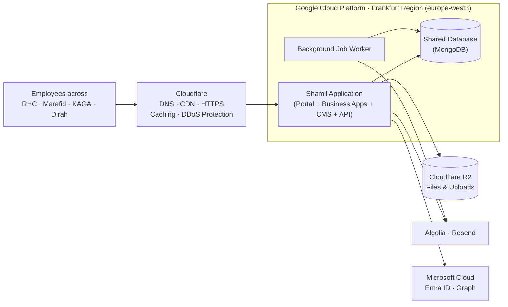

### 16.2 Deployment Pipeline

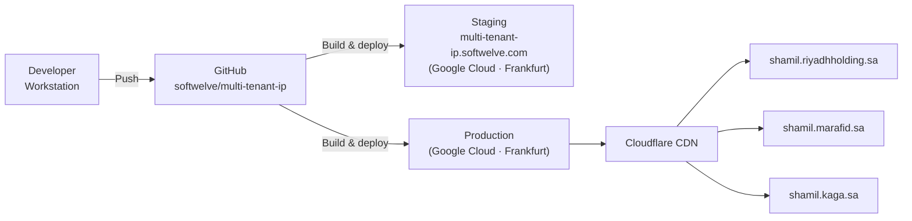

### 16.3 Hosting Summary

| Aspect | Details |
|---|---|
| **CDN and edge** | Cloudflare: DNS, content delivery, HTTPS, caching, and DDoS protection for all tenant addresses |
| **Application hosting** | Google Cloud Platform, Frankfurt region (europe-west3) |
| **Background job worker** | Dedicated worker process on Google Cloud, Frankfurt region |
| **Database** | MongoDB, Frankfurt region, one shared database with tenant-isolated data |
| **Files and uploads** | Cloudflare R2 object storage |
| **Identity provider** | Microsoft Entra ID |
| **Request path** | Employee → Cloudflare edge → tenant resolution → Google Cloud Frankfurt → database (Frankfurt) |
| **Performance tuning** | Database indexes for employees, requests, and audit logs, plus connection pooling and short-term caching of tenant and permission lookups |
| **Source control** | GitHub (`softwelve/multi-tenant-ip`) |
| **Environments** | Development/staging and production, with environment-tagged content |
| **Deployments** | Built from the GitHub repository and deployed to Google Cloud |
| **Operational tooling** | Scripts for tenant migration, search index sync and verification, job testing and retry, and data maintenance |
| **Monitoring** | Cloudflare analytics (traffic and threats), Google Cloud logging (application and worker health), audit logs (user activity) |

### 16.4 Onboarding a New Tenant

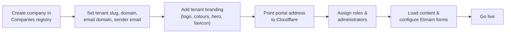

---

## 17. Glossary

| Term | Meaning |
|---|---|
| **Multi-tenant** | One platform serving several organisations (tenants), each with its own branding and isolated data |
| **Tenant** | A group company using the platform (RHC, Marafid, KAGA, Dirah) |
| **Superadmin** | A group-level administrator who can manage all tenants |
| **Etmam** | The portal's service request centre (from the Arabic for "completion") |
| **ITSM** | IT Service Management: raising, approving, fulfilling, and tracking service requests |
| **SLA** | Service Level Agreement: the target time to complete a request |
| **SSP / SSC** | Shared Services Performance / Shared Services Centre |
| **RBAC** | Role-Based Access Control: access granted through roles and permissions |
| **Audit Log** | A chronological record of who did what, and when |
| **CMS** | Content Management System: the admin panel for managing content and configuration |
| **Microsoft Entra ID** | Microsoft's corporate identity service (formerly Azure Active Directory) |
| **Microsoft Graph** | Microsoft's API for Microsoft 365 data such as calendars, tasks, and users |
| **Dynamics 365** | Microsoft's enterprise resource planning (ERP) platform, planned as the live data source for the SSP Dashboard |
| **Job Worker** | A background process that runs queued tasks outside the main portal |
| **Algolia** | A hosted search service giving fast, typo-tolerant search results |
| **Cloudflare R2** | Cloudflare's object storage service for files |
| **CDN** | Content Delivery Network: servers worldwide that deliver the portal quickly |
| **RTL** | Right-to-left text direction, used for Arabic |
| **HSTS** | A security setting that forces browsers to always use HTTPS |
